**Welcome anon!** So you've decided to eliminate third parties like Visa and [take control of your payments using BTCPay Server](https://bowtiedchukar.com/become-your-own-payment-processor/).  You're accepting Bitcoin payments straight into your cold storage wallet.  Now it's time to take advantage of instant, low fee Bitcoin payments on Lightning Network.

## Overview

We showed you how to [set up your own Bitcoin payment processor in 30 minutes](https://bowtiedchukar.com/become-your-own-payment-processor/) using [LunaNode](https://www.lunanode.com/?r=17252).  The default setup uses the Bitcoin blockchain.  Now we are going to add Bitcoin payments over the Lightning Network.

Lightning Network is a decentralized system that enables instant, low fee Bitcoin transactions.  [Here](https://lightning.network/) is a high level overview of the Lightning Network.

**WARNING:**  Please understand that the Lightning Network is still in the experimental stage. Do not put the money you can't afford to lose.  Also, BTCPay Server [recommends using c-lighting](https://docs.btcpayserver.org/FAQ/FAQ-LightningNetwork/#can-i-use-a-pruned-node-with-ln-in-btcpay) with a pruned node instead of LND.  It is possible in BTCPay to enable LND with a pruned node, however the LND implementation does not officially support it.  We plan to integrate Sphinx Chat with our LND node.  Sphinx Chat isn't compatible with c-lighting.  If you want to use a less riskly implementation, see [Set Up BTCPay Server with c-lightning and Add a Channel with Inbound Liquidity](/set-up-btcpay-server-with-c-lightning/).

We'll cover 5 steps to set up Lightning payments on your BTCPay Server:

1. [Configure BTCPay Server for Lightning](/add-lightning-to-btcpay-server/#1-configure-btcpay-server-for-lightning)
2. [Fund Bitcoin wallet](/add-lightning-to-btcpay-server/#2-fund-bitcoin-wallet)
3. [Open Lightning channel](/add-lightning-to-btcpay-server/#3-open-lightning-channel)
4. [Add Inbound liquidity](/add-lightning-to-btcpay-server/#4-add-inbound-liquidity)
5. [Enable Lightning option in BTCPay Store](/add-lightning-to-btcpay-server/#5-enable-lightning-option-in-btcpay-store)


## 1. Configure BTCPay Server for Lightning

We'll cover both adding Lightning during initial BTCPay Server setup and adding Lightning to an existing BTCPay Server.

### Add during initial BTCPay Server set up

If you haven't created your BTCPay Server, you can accomplish a majority of the configuration through through the LunaNode [BTCPay Server web form](https://launchbtcpay.lunanode.com/).  If you are taking this approach, you want to read through our [initial BTCPay Server post](https://bowtiedchukar.com/become-your-own-payment-processor/) first.

Select `LND` lightning option.  Then add you SSH pubkey, see [Using SSH Keys](https://www.lunanode.com/guides/quickstart) guide from LunaNode.  Leave all other options as default, including `m.4` since we are including Lightning.  Lighting Alias is optional.

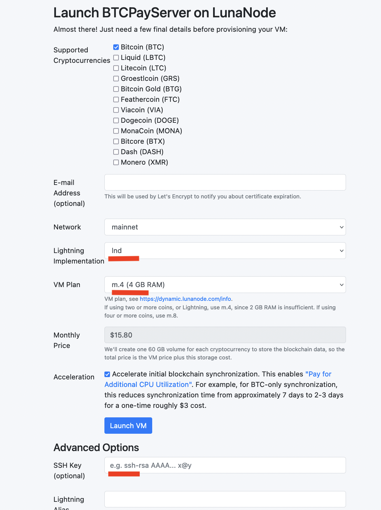

You will need to add ThunderHub following the instructions below starting with [logging into the VPS over SSH](/add-lightning-to-btcpay-server/#3-add-lnd-and-thunderhub) (you can skip the step to add `lnd`).

### Add to existing BTCPay Server

If you already deployed your BTCPay Server, you can add Lightning using the LunaNode Dashboard and Command Line.

##### 1. Resize VPS

Use the [LunaNode Dashboard](https://dynamic.lunanode.com/panel/) to resize from `m.2` to `m.4` per the LunaNode recommendation for running Lightning.  **Note:** this will increase your monthly cost.

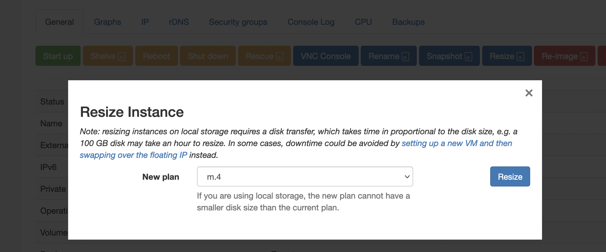

##### 2. Get SSH password and add SSH pubkey.

You can connect to the VM with SSH using the username and password specified in the Initial Login Details, which you'll see after selecting the VM from the Dashboard. Alternatively you can save your SSH pubkey during intital set up.  See more at https://www.lunanode.com/guides/quickstart.


##### 3. Add LND and ThunderHub

SSH into your VM replacing `000.00.000.000` with your External IP found in the LunaNode Dashboard.  You may also need to provide the filename if you are using a 2nd SSH identity for your anon avatar.

```bash
# separate ssh file for my bowtiedchukar identity
ssh -i ~/.ssh/id_ed25519_bowtiedchukar ubuntu@000.00.000.000
```

Now change to root and cd into the `btcpayserver-docker` folder.

```bash
# on vps ubuntu@000.00.000.00, change to root
sudo su -

cd btcpayserver-docker
```
Add the appropriate environmental variables from the [BTCPay Server docs](https://docs.btcpayserver.org/Docker/#generated-docker-compose) to add `lnd` and `thunderhub` then restart.

```bash
# on vps root@000.00.000.00, export new environmental variables and restart

export BTCPAYGEN_LIGHTNING="lnd"
export BTCPAYGEN_ADDITIONAL_FRAGMENTS="$BTCPAYGEN_ADDITIONAL_FRAGMENTS;opt-add-thunderhub"

. ./btcpay-setup.sh -i
```

Once your VM restarts, you'll be running LND and ThunderHub.  You can verify they are up and running.  Log in to your BTCPay Server then click `Server Settings` then `Services`.  LND and ThunderHub should be listed along with your Bitcoin Full Node services.

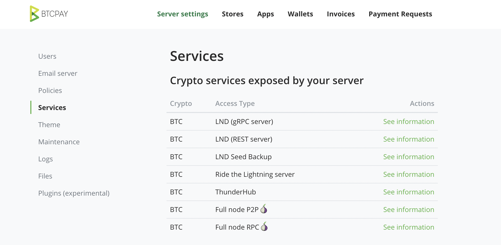

## 2. Fund Bitcoin wallet

We are going to use ThunderHub to manage out Bitcoin and Lightning nodes.  From your BTCPay Server `Services` tab, click Thunderhub `See information` to log in to ThunderHub in your browser.

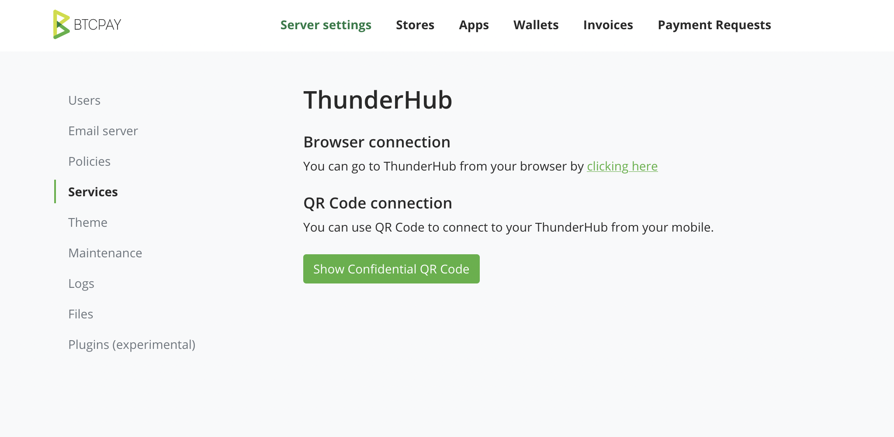

The first step is to fund the wallet on your Bitcoin node with .001-.0005 Bitcoin.  You can get the Bitcoin receive address from the main ThunderHub page.

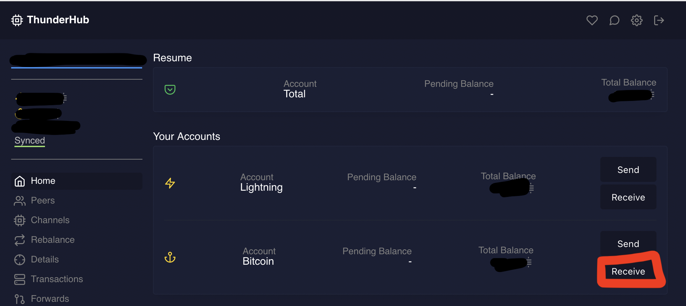

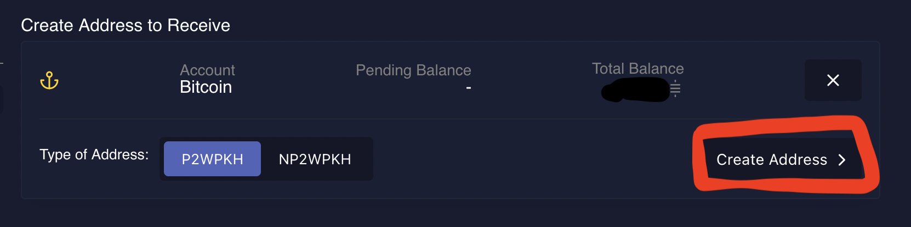

Once you click `Create Address` you can either copy the address text or scan the QR code. We suggest using [Strike.me](https://strike.me/) to fund your wallet, but you can send the Bitcoin with any Bitcoin wallet.

## 3. Open Lightning channel

[Sphinx Chat](https://sphinx.chat/) is a chat service built on Lightning.  Later we plan to add a post about [using Sphinx with your Lighting node](https://github.com/stakwork/sphinx-relay/wiki/Home-node-FAQ).  With that in mind, we are going to use the Sphinx Chat instructions to open our first channel.

Now that your Bitcoin node wallet is funded, we are going to use it to open a
channel with one of the [Sphinx nodes](https://github.com/stakwork/sphinx-relay/wiki/Home-node-FAQ#is-your-node-ready):

```
gameb_1: 023d70f2f76d283c6c4e58109ee3a2816eb9d8feb40b23d62469060a2b2867b77f@54.159.193.149:9735
gameb_2: 03c8dfbf829eaeb0b6dab099d87fdf7f8faceb0c1b935cd243e8c1fb5af71361cf@3.234.251.85:9735
```

Follow the Sphinx instructions to open a channel using ThunderHub [here](https://github.com/stakwork/sphinx-relay/wiki/Open-a-channel-with-Thunderhub).

Awesome!  You just opened your first Lightning Network channel. Don't forget to
update your channel's `base_fee` to 0 and `fee_rate` to 0.000001.  Sphinx will set
their channel to the same.

## 4. Add Inbound liquidity

If you followed the Sphinx instructions, you pushed 2,000 sats to the other side of the channel.  If you look at the channel details in ThunderHub, you'll see 90,000+ on your side of the channel and 2,000 sats on the other side of the channel.

This means you can spend/send 90,000 sats and you can only receive 2,000 sats before you'll need to increase the sats on the other side of the channel, i.e. add inbound liquidity.

I've found the simplest way to add inbound liquidity is to use ThunderHub to send bitcoin from my Lightning Node to another one of my Lightning wallets (i.e. [Strike](https://strike.me/), [Muun](https://muun.com/), or [Breez](https://breez.technology/)).

**Note:** with Breez you can also stream sats to your favorite podcasts, see my previous post [Let Your Podcast Audience Stream Sats While They Listen](https://bowtiedchukar.com/setup-your-podcast-to-stream-sats/).

Click send on the main ThunderHub page.

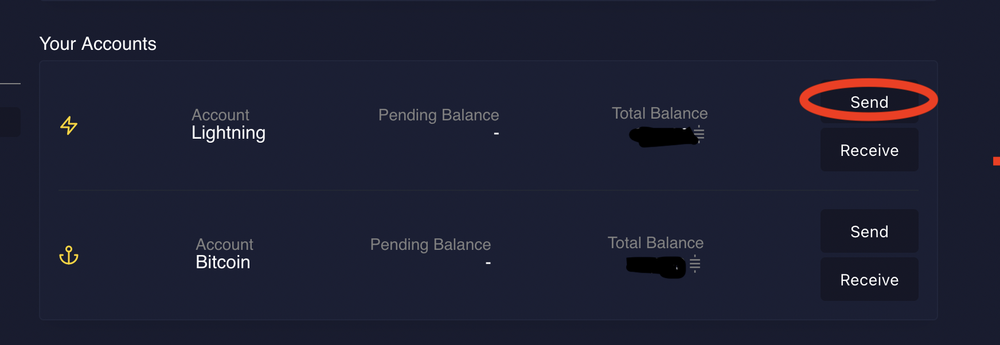

Paste the invoice string from your other Lightning wallet and hit pay.

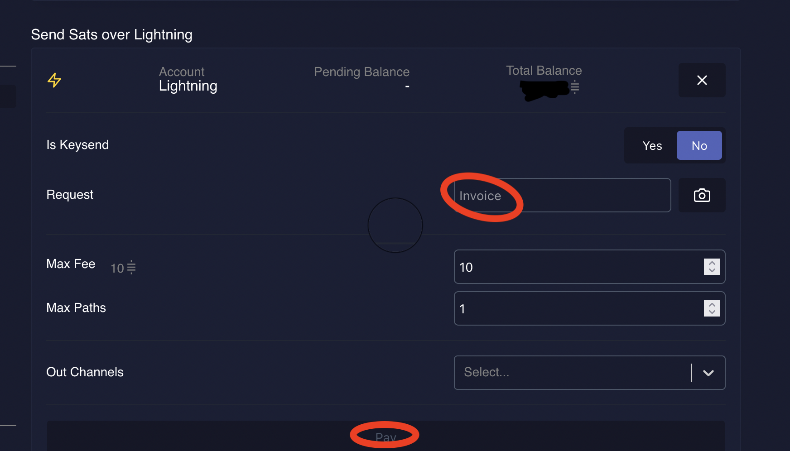


Now when you visit the `Channels` tab in ThunderHub, you should have more sats on the other side of the channel (i.e. inbound liquidity).  Here I've increased my inbound liquidity to 15K sats.

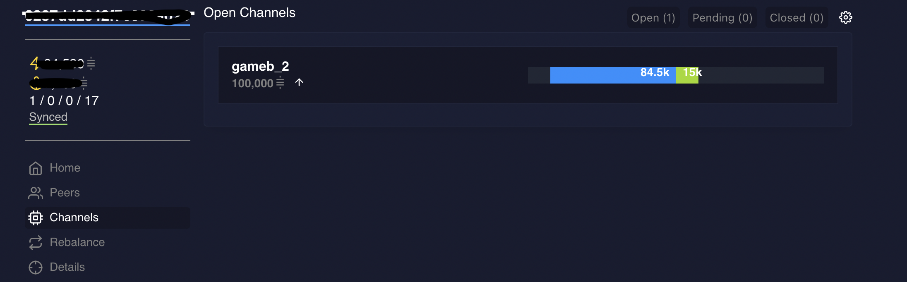

For more options to add liquidity, check out the [Lightning Node Management](https://www.lightningnode.info/createinboundliquidity).


## 5. Enable Lightning option in BTCPay Store

Now that your Lightning Node is up and running, you can add Lightning as a payment option in your store.

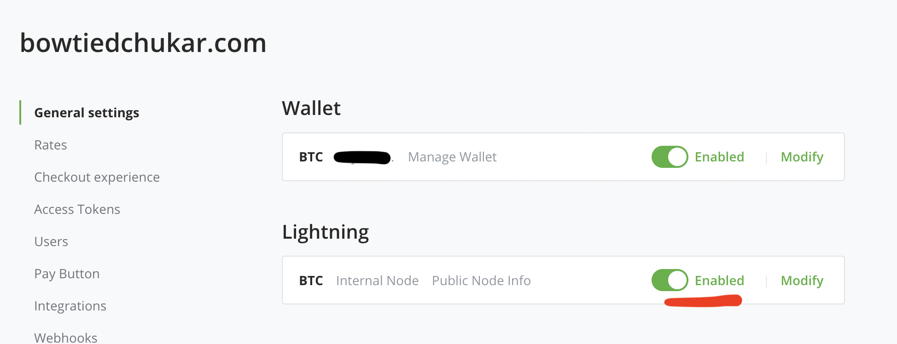

Now test out the pay button to send $1 using Lightning. You can test it using [Strike.me](https://strike.me/) or another Lightning wallet.  The cool thing about Strike is you can pay both Bitcoin and Lighting addresses very easily.

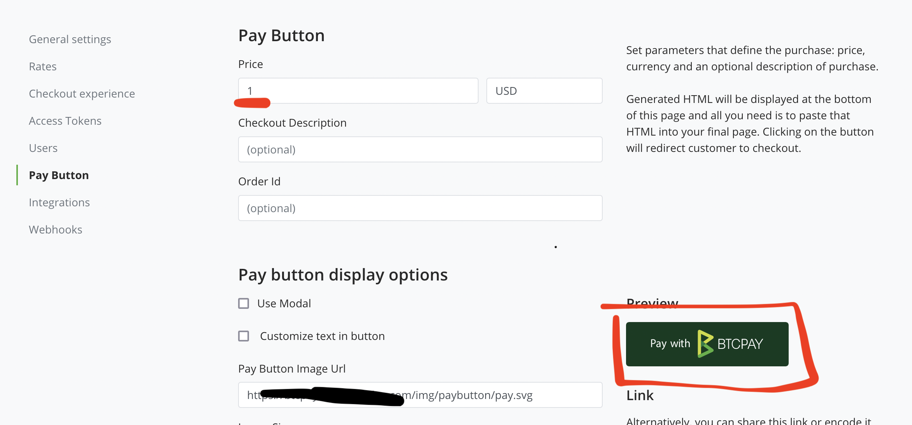

Here is the BTCPay Server with Lightning Network selected.

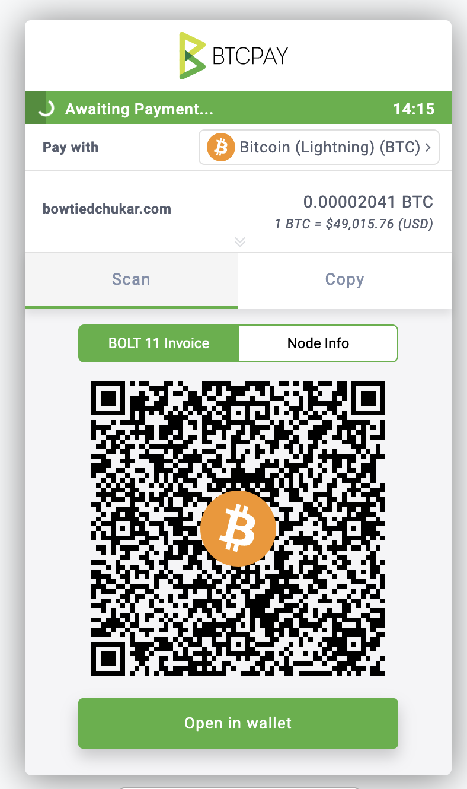

##### Success!!

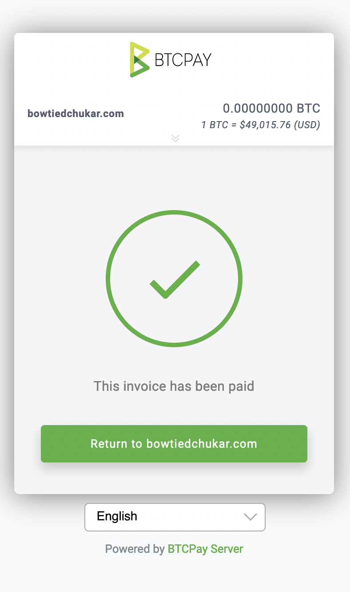

If you run into issues, check out the BTCPay Server docs for [Lightning Network](https://docs.btcpayserver.org/LightningNetwork/). Or send me a DM on Twitter ([@bowtiedchukar](https://twitter.com/bowtiedchukar)).

## Conclusion

When people use your BTCPay Server, they will now have the option to select Lightning payments for instant, low fee transactions!
