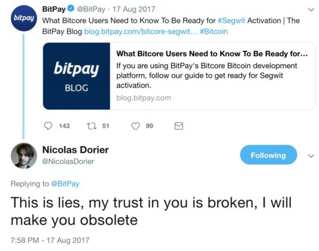

**Welcome avatar!**. Everyone knows #BanksAreZeros, but Visa, Mastercard, and Discover are also on the way to Zero.  We're going to make this obvious by showing you how to become your own Bitcoin payment processor with 30 mins of effort.

### BTCPay Server

[BTCPay Server](https://btcpayserver.org/) is an open-source, self-hosted payment processor for Bitcoin and [other cryptocurrencies](https://docs.btcpayserver.org/FAQ/FAQ-Altcoin/#which-coins-does-btcpay-server-support).

Payments with BTCPay go directly to your wallet. There is no address re-use since each invoice uses a new address for receiving payments to your wallet.

There are no subscriptions, no transaction fees. There's no third-party involvement which significantly increases the censorship-resistance, privacy, and security for you and your customers.

**With BTCPay, you are your own bank.**

### BTCPay project

BTCPay project has an awesome [origin story](https://bitcoinmagazine.com/technical/btcpay-server-is-bitcoins-open-source-unicorn):

> Nicolas Dorier [@nicolasdorier](https://twitter.com/nicolasdorier) began the open-source project as a direct adversary to BitPay after the payment processor posted an August 2017 blog post urging users to upgrade their BitPay software to SegWit compatibility. Only it wasn’t the real SegWit; BitPay was urging users to upgrade to SegWit2x, warning that its clients’ software could be at risk and that it would be supporting a minority chain if it didn’t push the upgrade.

> Dorier famously called B.S. on the masquerade, and vowed to make BitPay obsolete.

From [‘I Made BitPay Obsolete,’ Says BTCPay Dev, Nicolas Dorier](https://thebitcoinnews.com/i-made-bitpay-obsolete-says-btcpay-dev-nicolas-dorier/):

> **Nicolas Dorier:** Their obsolescence comes from lots of factors. I made them obsolete for businesses, which do not care to handle Bitcoin or some small set of altcoins. Creating your own BTCPay server is easier than passing BitPay’s KYC.

BTCPay is a perfect example of the power of free, open source software.  Now on
to deploying your own BTCPay Server.

### Deploying a BTCPay Server with LunaNode Web-Wizard

For the price of around $8.80 per month, you can have a self-hosted BTCPay Server with a Bitcoin full node.  Your BTCPay Server coordinates Bitcoin payments directly to your Bitcoin wallet.  It uses the full node to validate payments are confirmed on the Bitcoin blockchain.

We set up a [BTCPay Button](https://docs.btcpayserver.org/Apps/#payment-button) at the bottom of this article to allow readers of this blog to leave tips in Bitcoin.  BTCPay Sever has apps for [Point of Sale](https://docs.btcpayserver.org/Apps/#point-of-sale-app), [Crowdfunding](https://docs.btcpayserver.org/Apps/#crowdfunding-app), and [Lightning](https://docs.btcpayserver.org/Apps/#lightning-network-apps-lapps). It also has integrations with [Woo Commerce](https://docs.btcpayserver.org/WooCommerce/) and [Shopify](https://docs.btcpayserver.org/Shopify/).

While there are [multiple deployment options](https://docs.btcpayserver.org/Deployment/), the easiest option is the using the [LunaNode Web-Wizard](https://docs.btcpayserver.org/LunaNodeWebDeployment/).  The LunaNode Web-Wizard provides an easy, 1-click install for beginners/non-developers.

### Steps to deploy your own BTCPay Server

#### 1. Create the account and add credits

Create an account on [LunaNode](https://www.lunanode.com/?r=17252) *(This is an affiliate link.  We'll both receive $20 credits if you register from the link.  Thanks to [@bowtiedopossum](https://twitter.com/bowtiedopossum) for teaching me about affiliate links)*.

If you enter your credit card, you shouldn't need any additional credits.  You can also pay with Bitcoin.  If you pay with Bitcoin, you won't get the $20 credits, so you'll need to add at least $10 in credit.

You'll also need to verify a phone number.  I used [TextVerified](https://www.textverified.com/) for SMS verification.

#### 2. Create the API Key

Once your account has been verified, and credits added, go to the API section and create a new API. Do not close that page and proceed to step 3.

#### 3. Web-Wizard Deployment

1. Go to [https://launchbtcpay.lunanode.com](https://launchbtcpay.lunanode.com)
2. Paste the API Key and API ID created in step 2 and continue.
3. The simplest approach is to use the domain LunaNode assigns you.
4. Customize the web-wizard settings according to your needs.  **The only change we made was to switch to m.2 since we initially only plan to accept Bitcoin without Lightning ($8/month).**
5. Click Launch VM. Wait 6-7 minutes for Virtual Machine deployment.
6. Visit the domain LunaNode assigns you, [register an account](https://docs.btcpayserver.org/RegisterAccount/) on your BTCPay Server and log in.

#### 4. Sync Full Node

Now you need to wait for blockchain to fully sync. Depending on the plan you used and the number of coins you added, that can take 1-7 days. There is a $3 one-time charge for faster sync if you enable the CPU utilization. If you enable CPU utilization, with Bitcoin, it will take about 2 days. There will be a sync pop-up window when you log in until your node fully syncs.

If you get stuck, you can find videos and other resources at the [LunaNode Web-Wizard](https://docs.btcpayserver.org/LunaNodeWebDeployment/) guide.

### Pay Button

To add a [Pay Button](https://docs.btcpayserver.org/Apps/#payment-button) like we’ve added below, you'll need to accomplish the following steps:
1. [Create a store](https://docs.btcpayserver.org/CreateStore/)
2. [Set up your wallet for the store](https://docs.btcpayserver.org/WalletSetup/)
3. Create [Pay Button](https://docs.btcpayserver.org/Apps/#payment-button) for the store.
4. Copy and paste the generated pay button code into your website.  For reference here is the [commit](https://github.com/bowtiedchukar/bowtiedchukar-blog/commit/306625b278126347200937df14ce53f5b9f75806) adding the BTCPay Button to the BowTied Chukar blog.  We use an [HTML to JSX Compiler](https://magic.reactjs.net/htmltojsx.htm) to quickly convert the HTML to JSX for our Gatsby project while extracting a majority of styles into a css file.

### Conclusion

I plan to add posts covering additional customizations but you should be able to get a Bitcoin full node sync started in 30 mins using the simple steps above.  If you found this post helpful, consider sending a tip using the BTCPay Button below.

Apps like [Strike.me](https://strike.me/) make it easy to pay Bitcoin and Lightning invoices on your phone directly out of your US Trash Token accounts with little to no fees.

It should be clear Visa, Mastercard, and Discover are going to Zero just like the Banks.  All the animals in the Jungle selling online can obsolete VISA and become their own payment processor with [BTCPay Server](https://btcpayserver.org/).

#BanksAreZero #VISAisZero #WAGMI
