**Welcome avatar!** BTCPay Server is the simplest way to start accepting payments in Bitcoin.  BTCPay allows you to accept instant, low fee payments on Bitcoin Layer 2 - Lightning Network.  We're going to show you how to set up a c-lightning node for your BTCPay Server and a simple way to open a channel with inbound liquidity to start directly earning [no-KYC Bitcoin](https://bitcoiner.guide/nokyconly/).

## Overview

We started with how you [set up your own Bitcoin payment processor in 30 minutes](/become-your-own-payment-processor/) using [LunaNode](https://www.lunanode.com/?r=17252).  The default setup uses the Bitcoin blockchain.  Now we are going to add Bitcoin payments over the Lightning Network using [c-lightning](https://github.com/ElementsProject/lightning).

We have covered how to [set up BTCPay Server with LND](/add-lightning-to-btcpay-server/).  [LND](https://github.com/lightningnetwork/lnd) and [c-lightning](https://github.com/ElementsProject/lightning) are two different implementation of the Lightning Network protocol.  With LunaNode, we are using a pruned Bitcoin node. BTCPay Server [recommends using c-lighting](https://docs.btcpayserver.org/FAQ/FAQ-LightningNetwork/#can-i-use-a-pruned-node-with-ln-in-btcpay) with a pruned node.  C-ligtning is less risky than LND for Lightning using our BTCPay Server setup.

**WARNING:**  However, please understand that the Lightning Network is still in the experimental stage. Do not put in money you can't afford to lose.

We'll cover 3 steps to set up Lightning payments on your BTCPay Server:

1. [Configure BTCPay Server for c-lightning](set-up-btcpay-server-with-c-lightning/#1-configure-btcpay-server-for-lightning)
3. [Open Lightning channel with inbound liquidity](/set-up-btcpay-server-with-c-lightning/#2-open-lightning-channel-with-inbound-liquidity)
5. [Enable Lightning option in BTCPay Store](/set-up-btcpay-server-with-c-lightning/#3-enable-lightning-option-in-btcpay-store)


## 1. Configure BTCPay Server for Lightning

We'll cover both adding Lightning during initial BTCPay Server setup and adding Lightning to an existing BTCPay Server.

### Add during initial BTCPay Server set up

If you haven't created your BTCPay Server, you can accomplish all of the configuration through through the LunaNode [BTCPay Server web form](https://launchbtcpay.lunanode.com/).  If you are taking this approach, you want to read through our [initial BTCPay Server post](https://bowtiedchukar.com/become-your-own-payment-processor/) first.

Select `clightning` lightning option.  Then add you SSH pubkey, see [Using SSH Keys](https://www.lunanode.com/guides/quickstart) guide from LunaNode.  Leave all other options as default, including `m.4` since we are including Lightning.  Lighting Alias is optional.

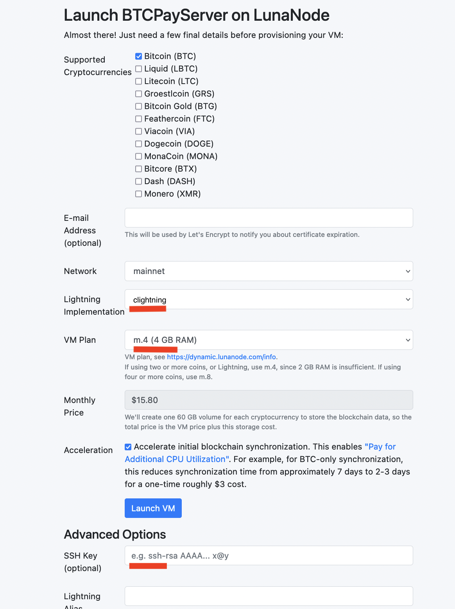

You're all set!  You can skip ahead to [Funding Your Bitcoin Wallet](/add-lightning-to-btcpay-server/#2-fund-bitcoin-wallet).

### Add to existing BTCPay Server

If you already deployed your BTCPay Server, you can add Lightning using the LunaNode Dashboard and Command Line.

##### 1. Resize VPS

Use the [LunaNode Dashboard](https://dynamic.lunanode.com/panel/) to resize from `m.2` to `m.4` per the LunaNode recommendation for running Lightning.  **Note:** this will increase your monthly cost.

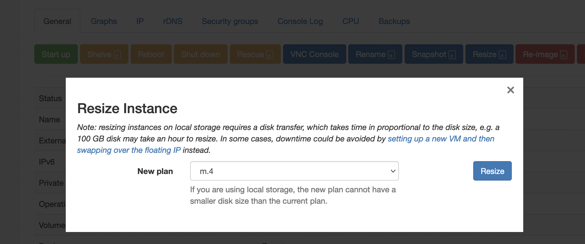

##### 2. Get SSH password and add SSH pubkey.

You can connect to the VM with SSH using the username and password specified in the Initial Login Details, which you'll see after selecting the VM from the Dashboard. Alternatively you can save your SSH pubkey during intital set up.  See more at https://www.lunanode.com/guides/quickstart.

##### 3. Add c-lightning

SSH into your VM replacing `000.00.000.000` with your External IP found in the LunaNode Dashboard.  You may also need to provide the filename if you are using a 2nd SSH identity for your anon avatar.

```bash
# separate ssh file for my bowtiedchukar identity
ssh -i ~/.ssh/id_ed25519_bowtiedchukar ubuntu@000.00.000.000
```

Now change to root and cd into the `btcpayserver-docker` folder.

```bash
# on vps ubuntu@000.00.000.00, change to root
sudo su -

cd btcpayserver-docker
```
Add the appropriate environmental variables from the [BTCPay Server docs](https://docs.btcpayserver.org/Docker/#generated-docker-compose) to add `clightning` and then restart.

```bash
# on vps root@000.00.000.00, export new environmental variables and restart

export BTCPAYGEN_LIGHTNING="clightning"

. ./btcpay-setup.sh -i
```

Once your VM restarts, you'll be running c-lightning with Ride The Lighting (RTL) to manage your node.  You can verify they are up and running.  Log in to your BTCPay Server then click **Server Settings** then **Services**.  C-Lighting and RTL should be listed along with your Bitcoin Full Node services.

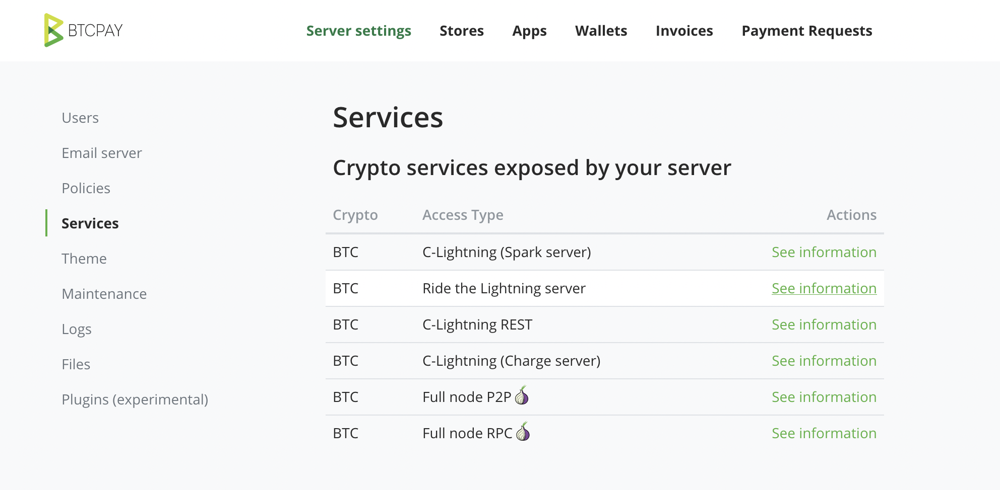

## 2. Open Lightning channel with inbound liquidity

Before you can begin accepting payments, you need to open a channel with inbound liqiudity.  This means there are sats on the other side of the channel you open that will move to your side of the channel as you accept payments.

If you are new to Lightning, check out the [Bitcoiner LN channel guide](https://bitcoiner.guide/lightning/#channels) to understand the basics of a Lightning Channel.

There are many [options for inbound liquidity](https://www.lightningnode.info/createinboundliquidity).  One thing to keep in mind is you are setting up a [Merchant](https://www.lightningnode.info/node-types/nodetype.merchant) node for your BTCPay Server.  You are not setting up a [Routing](https://www.lightningnode.info/node-types/nodetype.routing) node to generate a profit forwarding payments within the network.

There are all kinds of tools and techniques for balancing a Routing node.  But for our Merchant node, it is easiest to simply buy an incoming channel from one or more well connected and capitalized nodes.

With [LNBig](https://lnbig.com/#/open-channel), you can buy an inbound channel with 300K sats for around $1.  You can also choose to select a larger channel size if you expect more payments immediately.

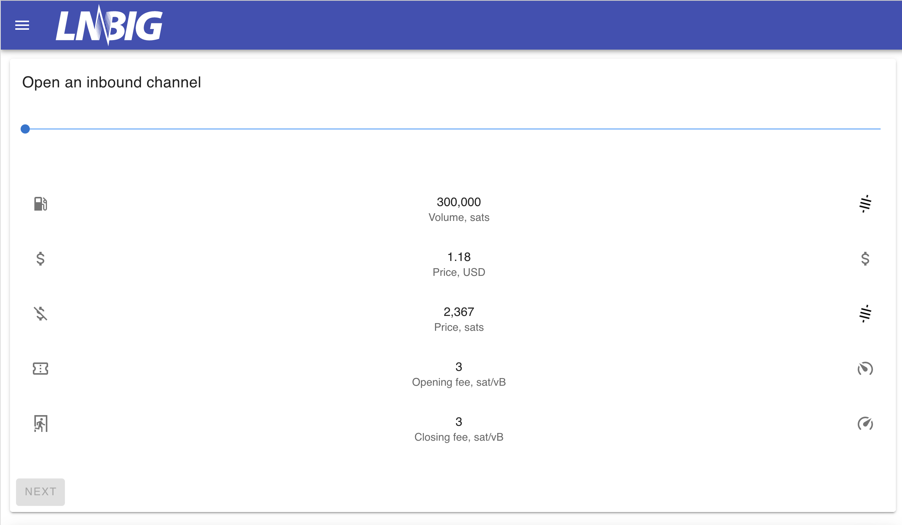

Once you select a channel size, you will be presented with a Lighitng invoice for the $1 payment to open the channel.  You need to pay the invoice with another Lightning wallet (e.g. [Strike](https://strike.me/) or [Muun](https://muun.com/)).  Both of these apps allow you to pay both regular Bitcoin addresses and Lightning invoices.

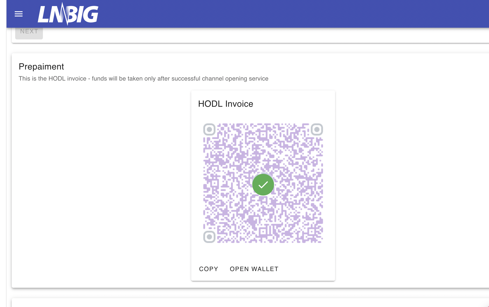

Once your payment is successful, you will be asked to provide your node info.

We are going to use Ride The Lighting (RTL) to manage our Bitcoin and Lightning nodes.  From your BTCPay Server **Services** tab, click **RTL -> See information** to visit the page to log in to RTL in your browser.

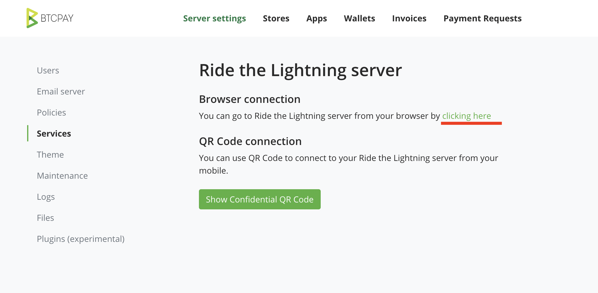

Click the **Public Key** tab and click **Copy node pubkey**

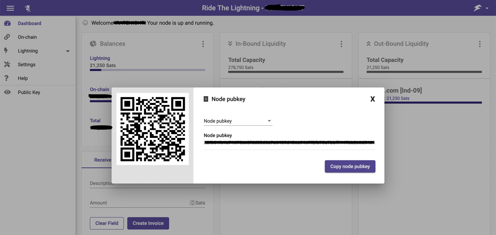

Paste your node public key into the Node Info form then click to verify the info.

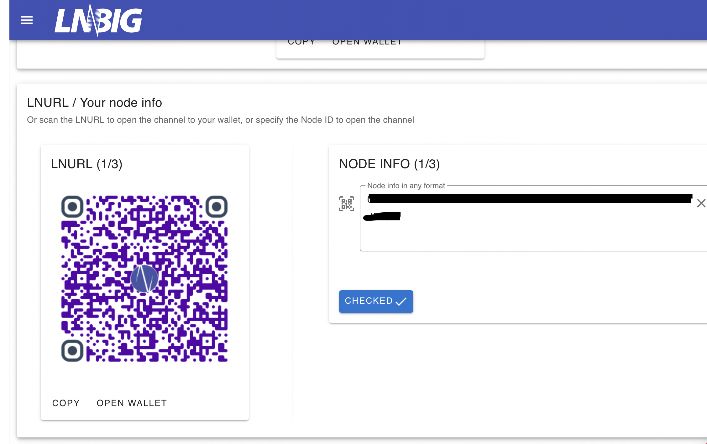

After you input your node info, LNBig will verify the info is correct.

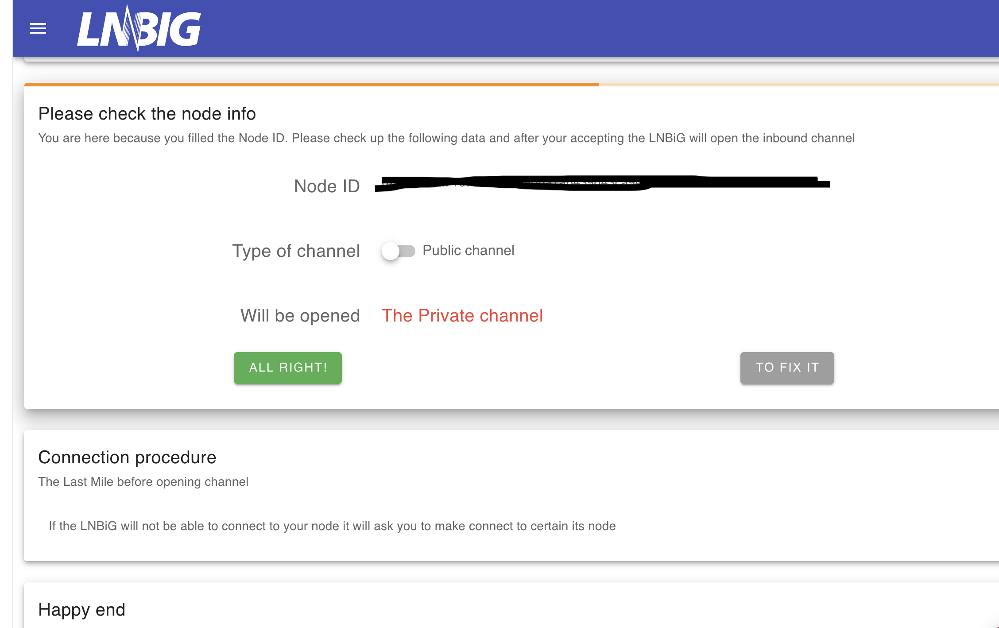

Once you click **All Right!** to confirm your node information, LNBig will provide information to connect your node to LNBig's node as a peer.

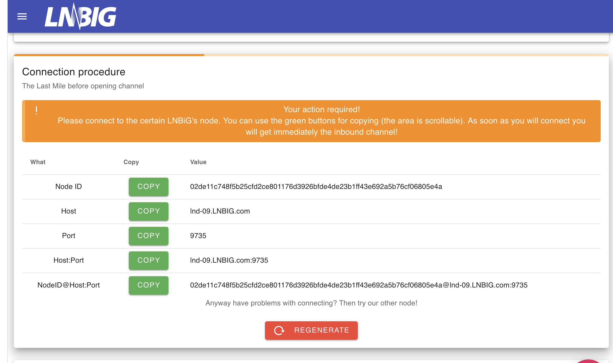

Copy the text string from `NodeID@Host:Port`.

Using RTL, add the LNBig node as a peer using the `NodeID@Host:Port`.

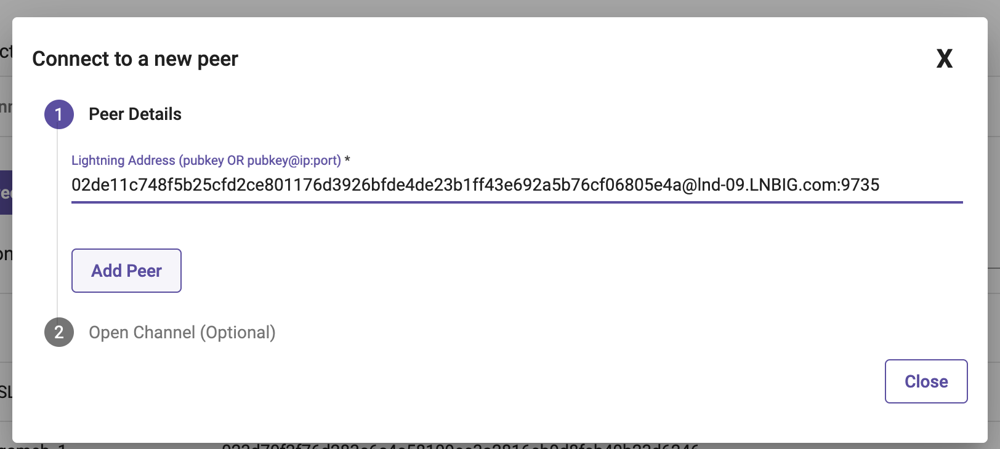

Once you add LNBig as a peer, LNBig will open the channel with your node.

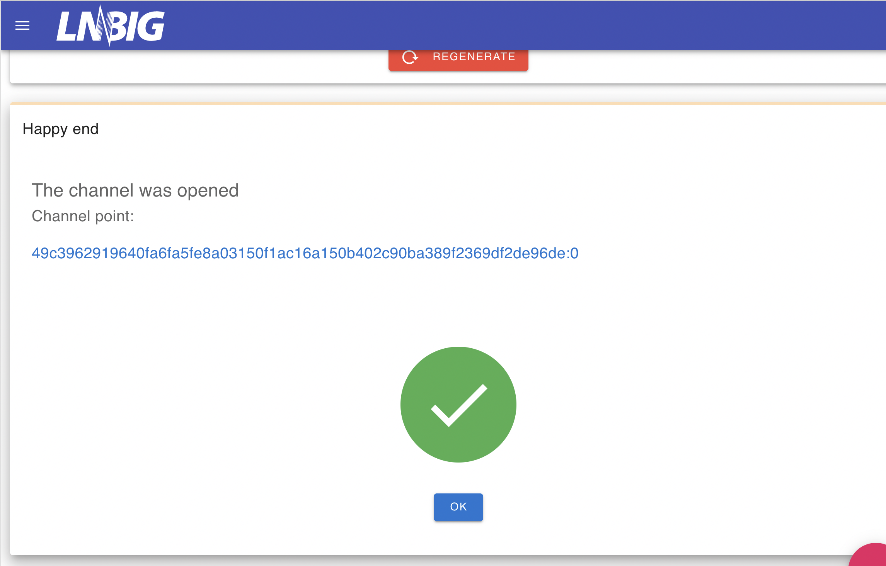

In RTL, the channel will show in the **Pending/Inactive** tab until the transaction to create the channel is confirmed on the Bitcoin blockchain.

Once the transaction is confirmed, the channel will be in the **Open** tab.  The channel should show a Local Balance of 0 sats and a Remote Balance of 300,000 sats.

## 3. Enable Lightning option in BTCPay Store

Now that your Lightning Node is up and running, you can add Lightning as a payment option in your store.

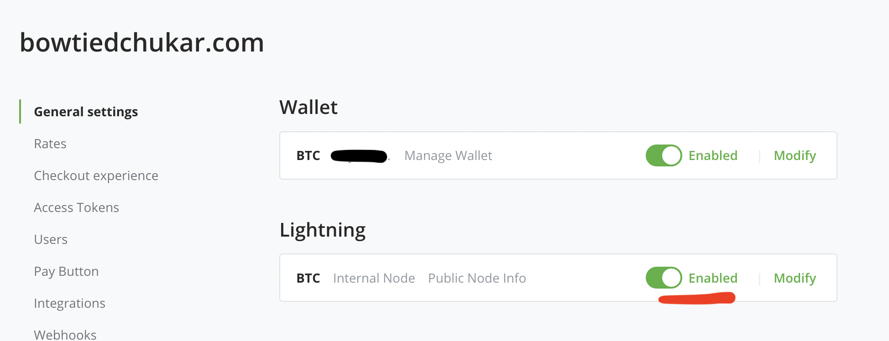

Test out the pay button to send $1 using Lightning. You can test it using the same wallet you used to pay LNBig.

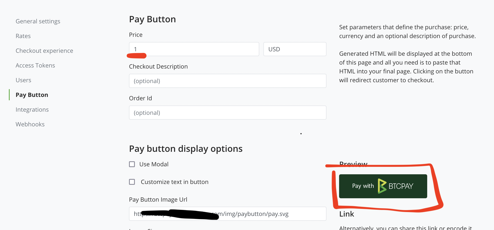

Here is the BTCPay Server with Lightning Network selected.

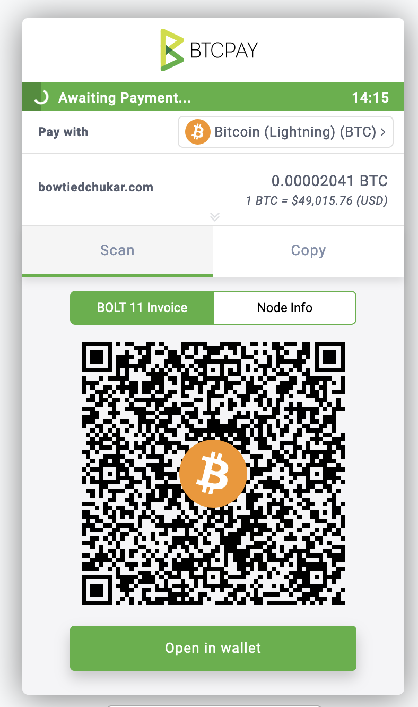

##### Success!!

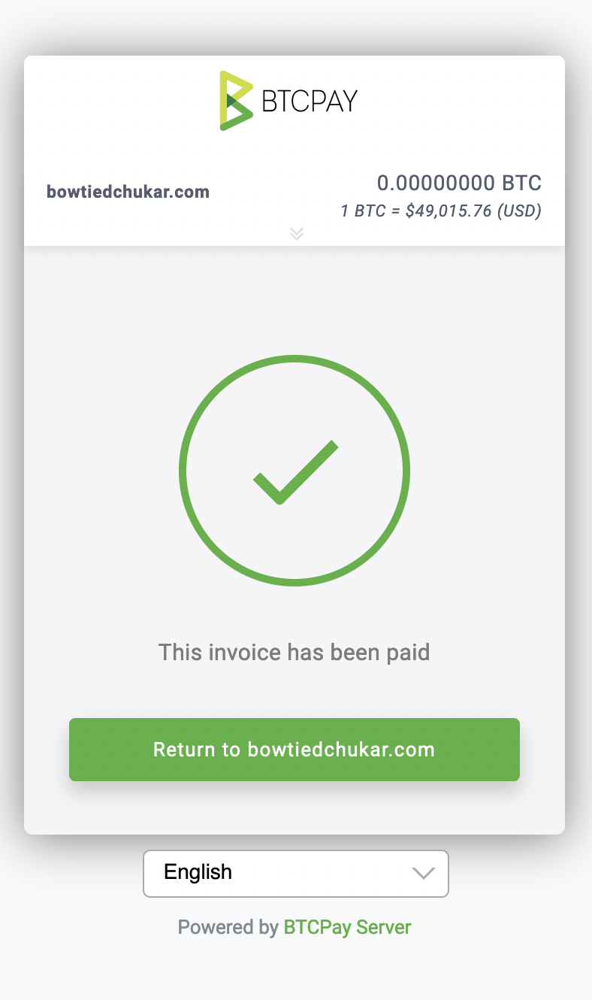

Using RLT, you can monitor you channel to see how much inbound liquidity (i.e. mSatoshi to Us) remains in the channel.  Click **Actions** -> **View Info** for the channel.  The channel will maintain a Reserve on each side for channel closing.  You can see the Reserve and the mSatoshi to Us (how many sats you can receive) and Spendable mSats (how many sats you can spend).

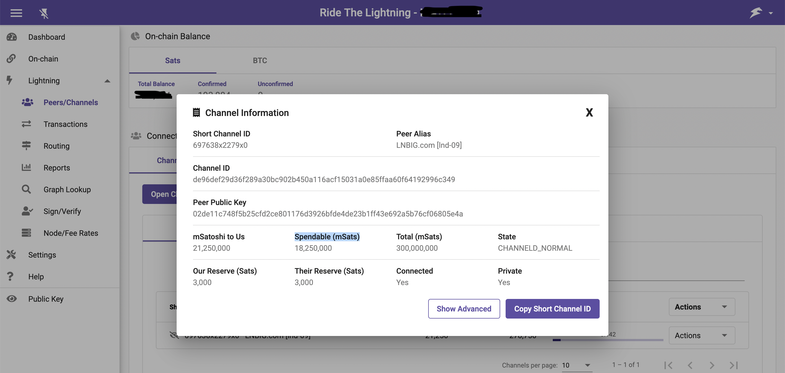

If you run into issues, check out the BTCPay Server docs for [Lightning Network](https://docs.btcpayserver.org/LightningNetwork/). Or send me a DM on Twitter ([@bowtiedchukar](https://twitter.com/bowtiedchukar)).

## Conclusion

With c-lightning, you can set up your own payment processor to accept instant, low fee Bitcoin payments.  LNBig is an easy way to buy inbound liquidity for your Merchant node.  For a couple dollars, you will be ready to accept donations, tips, or payments to your E-commerce store.
