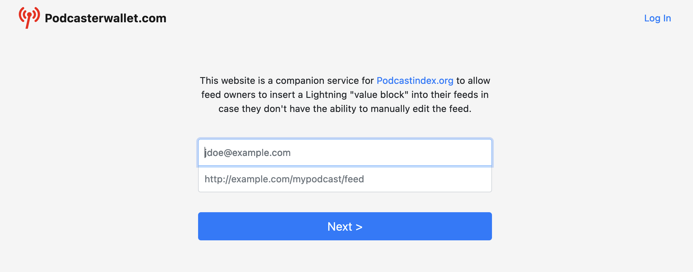
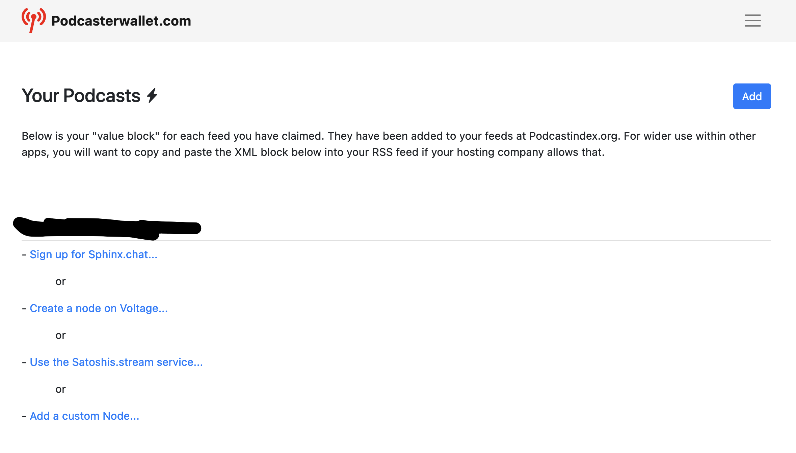
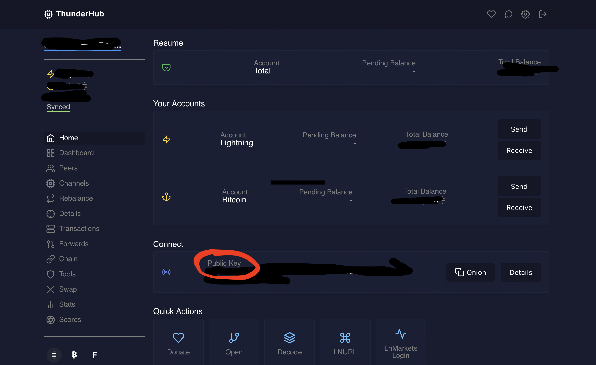
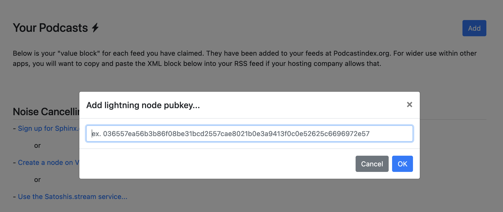
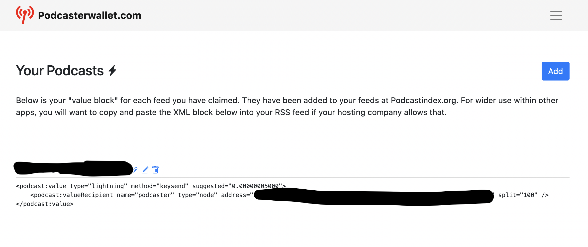
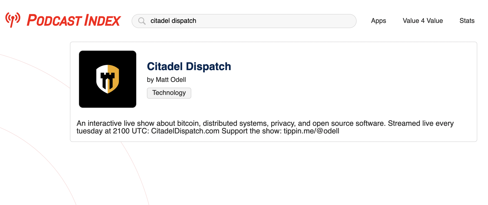

**Welcome anon!**  Do you have a podcast with loyal listeners?  With the Bitcoin Lightning network, your listeners can show their support by streaming sats while they listen.  [Value 4 Value Podcasts](https://podcastindex.org/podcast/value4value) are podcasts set up to receive Bitcoin payments in real-time over the Lightning network using Podcasting 2.0 apps such as [Breez](https://breez.technology/).

We’re going to walk you through the steps to start seeing the sats stream in as people enjoy your show!

### Use the Podcasting 2.0 Wizard

[Podcast Index](https://podcastindex.org/) has a [wizard](https://podcasterwallet.com/) to help you set up your podcast to accepts sats.

#### 1. Submit email address & podcast RSS

When you visit the [wizard](https://podcasterwallet.com/), you'll see a form to submit your email address and podcast RSS feed.

Your podcast RSS feed must be configured to include your email address.  You may need to adjust the settings in your podcast platform.

The wizard will validate your email is listed in your RSS feed and send you an email with a username and password.  Once you [sign in](https://podcasterwallet.com/sign-in) you'll see a screen with options to connect your lightning wallet to the RSS feed.

#### 2. Get lightning node pubkey from Thunderhub

We run our own Lightning node using [Umbrel](https://getumbrel.com/).  Umbrel allows you to install the [Thunderhub](https://thunderhub.io/) app to manage your Lightning node.  For the next step you'll need to get your Lighnting node pubkey from Thunderhub.

**Note:**  If you don't run your own Lightning node, you can also use the [Satoshis.stream](https://satoshis.stream/) service to stream sats to a lightning wallet that is not backed by your own node.

#### 3. Add pubkey to Podcasterwallet.com

Once you have your pubkey, you can add it using the **Add a custom Node** option.

Once you've saved your lightning node pubkey, you’re all set to start receiving sats!  

**Note:** You won't need to manually add the generated text to your RSS feed to work with the [Breez](https://breez.technology/) app.

#### 4. Check your Podcast is listed on Podcasting 2.0

Check to make sure your Podcast was added to [Podcast Index](https://podcastindex.org/).  We're going to use
[Citadel Dispatch](https://citadeldispatch.com/), a great podcast about bitcoin, distributed systems, privacy, and open source software, as an example for the rest of the post.

#### 5. Stream sats while you listen using Breez

Now download the [Breez](https://breez.technology/) app and search for your podcast in the podcast section of the app.  Your listeners will now be able to **boost** your podcast episodes which sends a lump sum amount and **stream** sats as they listen.

If you need to add sats to your Breez wallet to test it out, we recommend using [Strike.me](https://strike.me/) to send sats from your US Trash Token bank account to your wallet.  You can create an lightning invoice in Breez and paste it into Strike to transfer the Bitcoin over Lightning.

### Conclusion

Now your podcast has a new revenue stream of Bitcoin streaming straight to your Lightning wallet.  Your loyal listeners can show their support streaming sats while listening and boost their favorite episodes!
